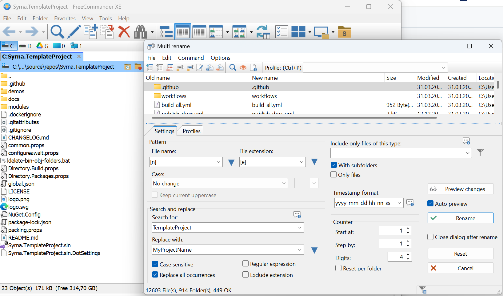
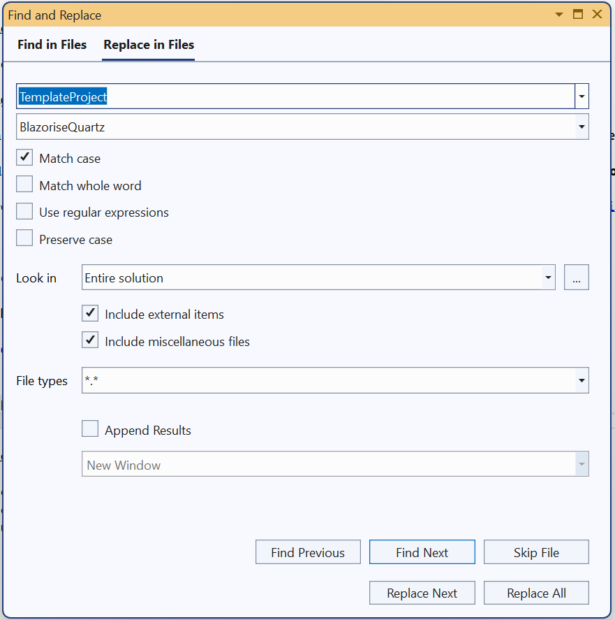

# Syrna.TemplateProject
Template project for ABP framework.

An abp application template for creating new solution.

## Installation

1. Download source codes and extract your new project folder

2. Follow usage notes

3. Add `DependsOn(typeof(TemplateProjectXxxModule))` attribute to configure the module dependencies. ([see how](https://github.com/SyrnaAbp/SyrnaAbpGuide/blob/master/docs/How-To.md#add-module-dependencies))
 
5. Add `builder.ConfigureTemplateProject();` to the `OnModelCreating()` method in **MyProjectMigrationsDbContext.cs**.
 
6. Add EF Core migrations and update your database. See: [ABP document](https://docs.abp.io/en/abp/latest/Tutorials/Part-1?UI=MVC&DB=EF#add-database-migration).

## Usage

[Download FreeCommander XE](https://freecommander.com/en/summary/)

Open File -> Multirename 

After than; 

> 1. edit "your project name".sln replace project names 
> 2. Open visual studio and call Edit -> Find And Replace -> Replace In Files (like in screen shot)
> 3. Build !

### Features

1. OpenIddict 
2. Demo and package modules splitted
3. Blazor modules
4. Build Action
5. Publish Action
6. Publish Docs Action
7. EntityFramework modules
8. Test modules
9. Web Modules
10. Integrated Auth/Identity system 

### Planning

1. MAUI
2. Angular